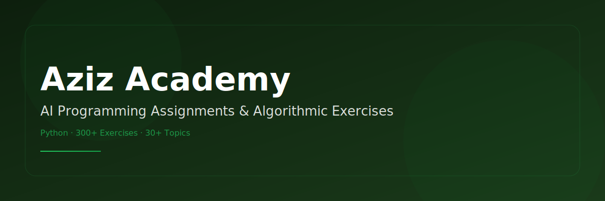

<div align="center">
  
  <h1>AI Programming Assignments</h1>
  <p>
    <strong>Python · Algorithmic Problem Solving · Coding Exercises</strong>
  </p>
  <p>
    
    
    
    
    
  </p>
</div>

---

## 📋 Overview

This repository contains **300+ programming assignments and exercises** completed as part of the **Aziz Academy — AI** course. These exercises demonstrate foundational programming skills in Python, covering algorithmic thinking, problem-solving, and software development fundamentals — from basic syntax to advanced data structures.

---

## 📚 Topics Covered

The exercises are organized into **20+ topic categories** covering the Python programming spectrum:

| # | Topic | Focus Area |
|---|-------|------------|
| 1 | **Basic Output** | `print()`, strings, escape sequences |
| 2 | **Variables & Data Types** | int, float, str, bool, type casting |
| 3 | **Strings** | Manipulation, slicing, methods, formatting |
| 4 | **Conditional Statements** | if/elif/else, nested conditions |
| 5 | **Logical Operators** | and, or, not, operator precedence |
| 6 | **Comparison Operators** | ==, !=, <, >, <=, >= |
| 7 | **Type Casting** | int(), float(), str() conversions |
| 8 | **Basic Operators** | Arithmetic, modular, exponentiation |
| 9 | **Best Practices** | PEP 8, meaningful naming, comments |
| 10 | **Error Handling** | Common errors, debugging, try/except |
| 11 | **Nested Conditions** | Complex decision trees |
| 12 | **Menu Systems** | Interactive console menus |
| 13 | **For Loops** | Iteration, patterns, nested loops |
| 14 | **Break & Continue** | Loop control flow |
| 15 | **While Loops** | Conditional iteration |
| 16 | **Loop Patterns** | Nested loops, triangles, pyramids |
| 17 | **Lists** | Indexing, slicing, methods |
| 18 | **List Operations** | append, insert, remove, pop |
| 19 | **List Slicing** | Advanced slicing techniques |
| 20 | **Filtering & Mapping** | List comprehensions |
| 21 | **Tuples** | Immutable sequences |
| 22 | **Tuple Unpacking** | Multiple assignment |
| 23 | **Dictionaries** | Key-value operations |
| 24 | **Sets** | Uniqueness, set operations |
| 25 | **Nested Data** | Complex data structures |
| 26 | **Practical Problems** | Real-world applications |
| 27 | **Statistics** | Mean, median, mode, range |
| 28 | **Table Formatting** | Console-based tables |
| 29 | **Advanced Filtering** | Lambda, map, filter |
| 30 | **Set Operations** | Union, intersection, difference |
| 31-35 | **Functions & Advanced** | Parameters, return values, scope |

---

## 🛠 Tech Stack

- **Language:** Python 3.12
- **Topics:** Algorithms, Data Structures, Problem Solving, Logic Building
- **Style:** PEP 8 compliant, well-commented Uzbek descriptions

---

## 🚀 Usage

```bash
git clone https://github.com/Sardor-Dev-2010/aziz-academy-topshiriqlar.git
cd aziz-academy-topshiriqlar
```

Each task can be run independently with Python 3:

```bash
python "01-1__Kvadrat_yig_indisi.py"
```

No external dependencies required — pure Python standard library.

---

## 📂 Structure

```
aziz-academy-topshiriqlar/
├── 01-Basic_Output/           # Basic print statements
├── 02-Variables/              # Variable assignments
├── 03-Strings/                # String operations
├── 04-Conditionals/           # If/else statements
├── ...                        # 30+ topic folders
├── Avtomobilning_Yuqori_Tezligi.py  # Standalone challenges
├── Bank_hisobvaragining_umumiy_balansi.py
├── CHANGELOG.md
└── LICENSE
```

---

## 📄 License

This project is licensed under the MIT License. See [LICENSE](LICENSE) for details.

---

## 👨‍💻 Author

**Elmurodov Sardor** — Full-Stack Developer (Python, Flutter, AI)
- GitHub: [@Sardor-Dev-2010](https://github.com/Sardor-Dev-2010)
- Email: sardor007elmurodov@gmail.com

---

<div align="center">
  
</div>
